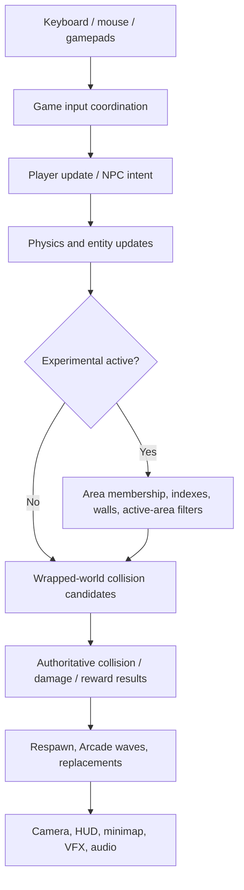
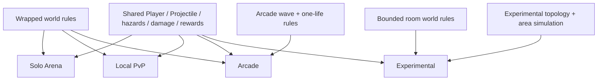
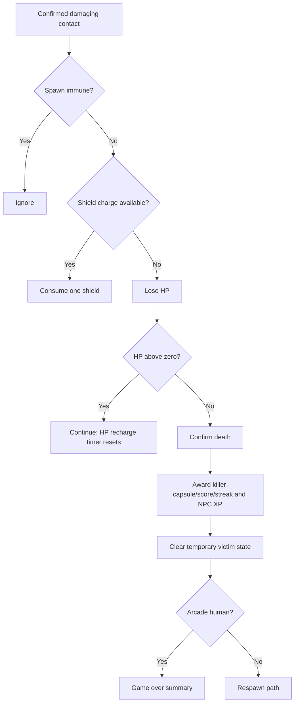
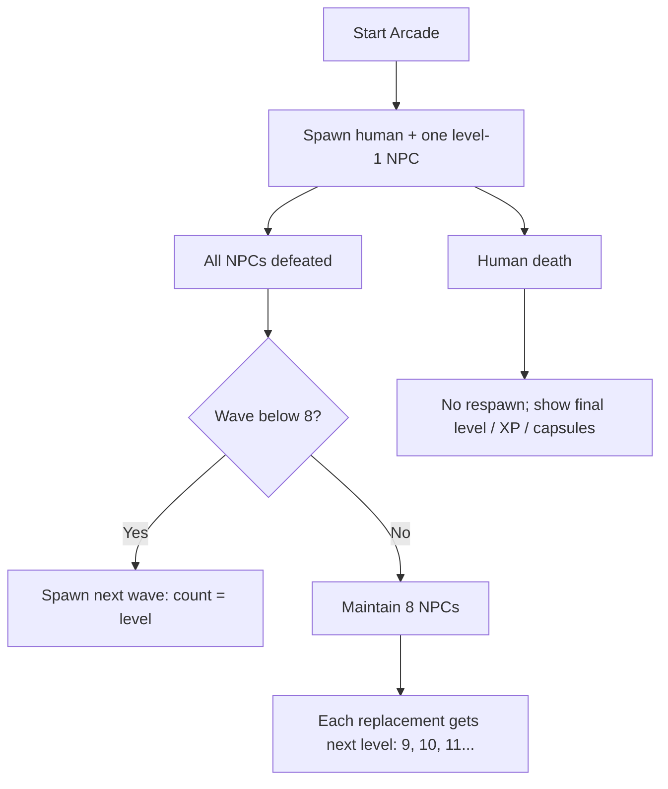
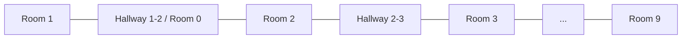

# Zorka: Battle for the Solar Tides — System Interaction Map

This document maps how the active local runtime, shared gameplay systems, Arcade Mode, and Experimental Mode interact.

## High-Level Runtime Flow



Gameplay truth lives in `Game` and canonical entity instances. Presentation reads or reacts to that truth.

## Mode Composition



Modes compose shared entity and combat contracts. Arcade and Experimental add explicit mode-specific coordinators rather than duplicate core entities.

## Runtime Composition

```text
main.js
  ↓
Game
  ├─ Camera
  ├─ HUD
  ├─ AudioManager
  ├─ players[]          authoritative
  ├─ asteroids[]        authoritative
  ├─ hazards[]          authoritative
  ├─ projectiles[]      authoritative
  ├─ vfx[]              authoritative/presentation lifecycle
  ├─ Arcade state       wave, replacement level, game over
  └─ Experimental state
       ├─ immutable areas / rooms / doors
       ├─ session ID
       └─ per-area indexes (derived)
```

## Standard Update and Combat Flow

```text
Input / gamepads
  ↓
Player.update() or Player.updateNPC()
  ↓
updateNewtonian() + standard world wrap
  ↓
Game.handleFire() → Projectile instances
  ↓
Game.checkCollisions()
  ↓
Game.hitTarget() / detonation / resolvePlayerDamage()
  ↓
collection mutation, rewards, death, respawn/replacement
  ↓
Camera + HUD + AudioManager render/react
```

## Experimental Update Flow

```text
Human current area
  ↓
hasHumanInExperimentalArea(areaId)
  ↓
active-area NPC / satellite / VFX / audio work only
  ↓
entity update with worldRules.wrap = false
  ↓
resolveExperimentalPlayerRoomMembership()
  ↓
resolveExperimentalEntityWalls()
  ↓
area-indexed collision candidates
  ↓
room-local authoritative outcomes
  ↓
current-area rendering + doorway-continuity walls
```

Rooms without a human avoid expensive intent, firing, VFX, and spatial-audio work. Canonical arrays remain authoritative even when area indexes narrow candidate sets.

## Ownership Map

| State or rule | Authoritative owner | Primary consumers |
| --- | --- | --- |
| Mode/screen state and Arena Options | `Game` | setup menus, spawn logic, HUD/rendering |
| Canonical entity collections | `Game` | update, collision, rendering, area indexes |
| Ship movement/aim/control | `Player` | `Game`, camera, renderer |
| Aim-lock target and controller lock latch | `Player`; acquisition/validation coordinated by `Game` | missiles, cursor, aim outline |
| XP, level, pending upgrades | `Player` | HUD, Arcade summary, NPC initialization |
| HP and recharge | `Player`; damage ordering in `Game.resolvePlayerDamage` | HUD, death flow |
| Shield capacity/charges/recharge | `Player`; setup/respawn in `Game` | HUD, damage flow, audio |
| Capsules and temporary powers | `Player` | input intents, HUD, death cleanup |
| Projectile lifetime/travel/special state | `Projectile` | collision, renderer |
| Projectile insertion/removal and impact outcome | `Game` | canonical collection, indexes, audio/VFX |
| Asteroid tier data | `Asteroid` | `Game.hitTarget`, renderer |
| Hazard identity/reward data | hazard instances | `Game.hitTarget`, XP/audio/VFX |
| Damage, death, rewards, respawn | `Game` | entities, HUD, audio, mode reconciliation |
| Arcade wave/game-over state | `Game` | NPC spawning, Arcade overlay |
| Experimental topology/geometry | `world/experimental_rooms.js` | `Game`, physics, camera, tests |
| Experimental entity membership | entity `roomId`, coordinated by `Game` | indexes, collision, targeting, rendering |
| Experimental area indexes | derived sets in `Game` | candidate lookup and performance only |
| Camera transform | `Camera` | world renderer/input conversion |
| HUD/minimap | `HUD` | canvas presentation only |
| Audio playback | `AudioManager` | presentation only |

## Damage and Progression Flow



Level flow:

```text
XP award
  ↓
Player.addXP()
  ↓
level threshold crossed
  ↓
+1 max HP and +1 current HP
  ↓
+1 pending level-up
  ↓
Projectile / Speed / Shield choice
```

Shield choice adds one maximum and one current shield charge. Shield recharge then refills toward the current maximum using the configured delay.

## Aim Lock and Missile Flow

```text
Mouse padded hit OR controller right-stick ray + LT edge
  ↓
Game selects valid target
  ↓
Player.lockedAimTarget
  ↓
Projectile.updateMissile()
  ├─ valid owner lock → use it now
  └─ no valid owner lock → missile-owned automatic fallback
```

Standard target selection uses wrapped displacement. Experimental target selection requires matching area membership.

## Projectile Flow

```text
Player.fire()
  ↓
weapon-specific projectile list
  ↓
Game.handleFire() / addProjectile()
  ↓
Projectile.update()
  ├─ ordinary Normal/Antigun/Double: independent world-width distance cap
  ├─ Laser: specialized lifespan
  ├─ Missile: homing + detonation
  ├─ Skinny missile: AoE detonation
  ├─ Orbital: owner-relative movement
  └─ Tentacle: extension/retraction state
  ↓
Game collision/wall outcome
  ↓
removeProjectile() + aim-lock cleanup + VFX/audio
```

## Arena Object Interactions

| Object | Contact with ship | Projectile result | Reward/result |
| --- | --- | --- | --- |
| Enemy ship | shield → HP → death | destructible | killer gains capsule, score/streak; NPC victim also grants level-based XP |
| Asteroid | shield → HP → death | splits by tier | terrain/cover; no capsule |
| Space Debris | shield → HP → death | destructible, including missile hits | 5 XP; no capsule; delayed replacement |
| Satellite | shield → HP → death; fires rogue shots | destructible, including missile hits | 15 XP; no capsule; replacement spawns |
| Projectile/missile | weapon-specific damage | may be targetable by locks/missiles | authoritative detonation/removal |

## Arcade Flow



Transformations are disabled and hardcore reset is always active in Arcade.

## Experimental Area and Door Flow



Each numbered room has independent populations and progression metadata. Hallways are transition areas with no persistent population.

Door outcomes by category:

| Category | Door/wall outcome |
| --- | --- |
| Human player | passes entrance; membership commits after clearance |
| NPC ship | blocked/slid within its area |
| Ordinary projectile / Laser / tentacle / orbital | removed at first blocker contact |
| Missile / skinny missile | detonates once, then removed |
| Large/medium body | reflected/confined |
| Small asteroid | environmentally destroyed; no reward/children; room-local replacement may be scheduled |
| Satellite / debris | confined by Experimental wall policy |

## Experimental Isolation Rules

```text
entity A + entity B
  ↓
same roomId?
  ├─ yes → normal candidate/contact rules
  └─ no → reject
          except genuine human/environment contact at their shared doorway
```

The same area filter applies to:

- NPC targeting and firing
- aim-lock validity
- collisions
- missile/AoE blast results
- satellite shots
- spatial audio
- VFX updates/rendering
- entity rendering and minimap markers

## Population Flow

```text
Arena option levels
  ↓
getArenaPopulationTargets()
  ├─ Standard mode → one global population target
  └─ Experimental → same target independently for each numbered room
```

Experimental replacement scheduling captures the current session ID and room ID so cleanup or a new session invalidates stale callbacks.

## Camera and Rendering Flow

### Standard

```text
Player position
  ↓
Camera wrapped nearest representation
  ↓
global entity render + global minimap scaling
```

### Experimental

```text
Player current area
  ↓
Camera direct/room transform
  ↓
current-area entity filter
  ↓
viewport bounds + cull margin
  ↓
current-area entities + necessary doorway-continuity walls
  ↓
area-local minimap
```

Cleanup restores the wrapped camera strategy and default gameplay zoom.

## Presentation Boundary

```text
Authoritative result
  ↓
Game/entity mutates live state
  ↓
HUD reads it / Camera transforms it / AudioManager plays effect / DOM shows mode overlay
```

Do not reverse this flow. Menus dispatch choices; they do not store alternate gameplay truth. The pause menu is presentation and does not stop simulation.

## Offline Scope

The active runtime is fully local. Solo, Local PvP, Arcade, and Experimental do not depend on networking. Any network module left in the repository is legacy and must not be treated as an authoritative path.

## Fast Debug Paths

For general gameplay:

1. authoritative owner (`Game`, `Player`, `Projectile`, or arena object)
2. update/collision/damage rule
3. spawn/setup/input path
4. derived indexes/world rules
5. presentation consumer

For Experimental:

1. immutable area/door definition
2. entity `roomId` and area index reconciliation
3. human-presence/active-area filter
4. wall or cross-area candidate rule
5. camera/minimap/render/audio consumer

For timing-sensitive outcomes, trace:

**collision → authoritative result → canonical collection/progression mutation → replacement/respawn → VFX/audio/HUD**
