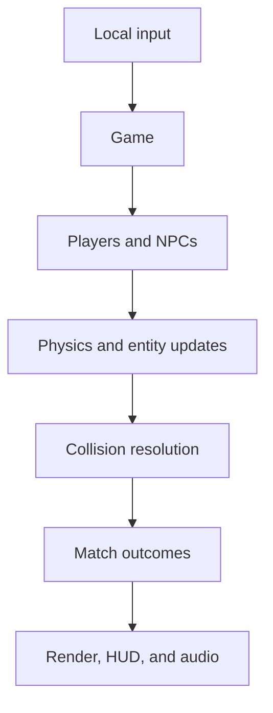
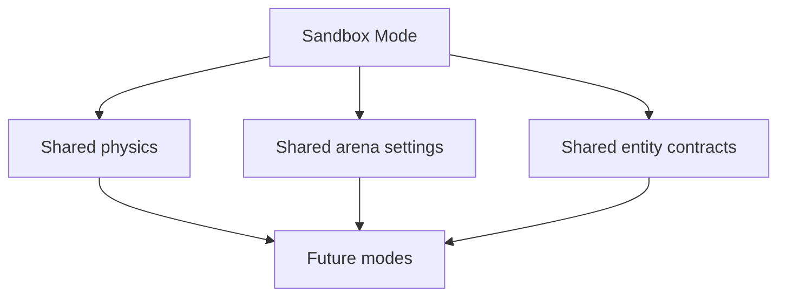

# Zorka: Battle for the Solar Tides — System Interaction Map

This document shows how Zorka's active offline Sandbox runtime interacts today and where future modes should connect.

## High-Level Flow



Key rule: gameplay truth lives in `Game` and the live entity instances. The HUD, menus, camera, and audio read or react to that truth.

## Mode Foundation



Sandbox Mode is not a disposable prototype. It is the standard ruleset and testing ground from which future modes should inherit their flight, wrapping, entities, rewards, and configuration behavior.

## Runtime Composition

```text
main.js
  ↓
Game
  ├─ Camera
  ├─ HUD
  ├─ AudioManager
  ├─ players[]
  ├─ asteroids[]
  ├─ hazards[]
  ├─ projectiles[]
  └─ vfx[]
```

`Game` constructs the runtime, loads assets, binds input, begins the frame loop, and owns the current match collections.

## Update and Combat Flow

```text
Input / gamepads
  ↓
Player.update() or Player.updateNPC()
  ↓
updateNewtonian() + world wrap
  ↓
Game.handleFire() → Projectile instances
  ↓
Game.checkCollisions()
  ↓
Game.hitTarget() / Game.playerDeath()
  ↓
entity removal, asteroid splitting, capsule rewards, respawn timers
  ↓
Camera + HUD + AudioManager render/react
```

## Ownership Map

| State or rule | Authoritative owner | Primary consumers |
| --- | --- | --- |
| Match state and arena options | `Game` | menus, spawn logic, HUD/rendering |
| Ship flight, weapons, capsules, power-ups | `Player` | `Game.handleFire`, HUD, renderer |
| Wrapping and shared movement math | `physics.js` | players, asteroids, hazards |
| Asteroid hit tier and splitting outcome | `Asteroid` data + `Game.hitTarget` | render, collision logic |
| Debris/satellite reward outcome | hazard data + `Game.hitTarget` | XP progression, audio/VFX |
| Projectile lifetime, launch-time target, and special behavior | `Projectile` | collision resolution, renderer |
| Death, shields, respawn | `Game.playerDeath` / `Game.respawnPlayer` | HUD, VFX, audio |
| Camera transform | `Camera` | world renderer |
| HUD display | `HUD` | canvas presentation only |
| Audio playback | `AudioManager` | presentation only |

## Arena Object Interactions

| Object | Contact with ship | Projectile result | Reward/result |
| --- | --- | --- | --- |
| Enemy ship | Damage/death unless shielded | Can be destroyed by weapons | Killer gains capsule and score progression |
| Asteroid | Lethal unless shielded | Splits by tier; replenishes large asteroids | Terrain/cover, no capsule |
| Space Debris | Lethal unless shielded | Destructible | Destroyer gains 5 XP and no capsule; may respawn |
| Satellite | Lethal unless shielded; fires rogue shots | Destructible | Destroyer gains 15 XP and no capsule; replacement satellite spawns |
| Power-up capsule stack | N/A | N/A | Player spends current stack to select an upgrade; death clears it |

## Presentation Boundary

```text
Authoritative result
  ↓
Game mutates live state
  ↓
HUD reads state / Camera renders it / AudioManager plays a requested effect
```

Do not reverse this flow. A button can request a mode or option change; it must not own an alternate copy of the selected match rules. A HUD display can show capsule count; it must not track the count independently.

## Offline Scope

The active architecture is local-only: Solo Arena and Local PvP Arena. Networking is not an active dependency for Sandbox or future modes unless the product direction explicitly changes. Any leftover network module is legacy code, not a source of truth for offline match behavior.

## Fast Debug Path

When a gameplay behavior is wrong, inspect in this order:

1. the owner of the affected live state (`Game`, `Player`, `Projectile`, or arena object)
2. the update/collision rule applying it
3. the spawn or match-option path that initialized it
4. presentation code only after the authoritative state is correct

For hit, death, reward, or destruction bugs, trace: **collision → result owner → collection mutation/respawn → VFX/audio/HUD**.
